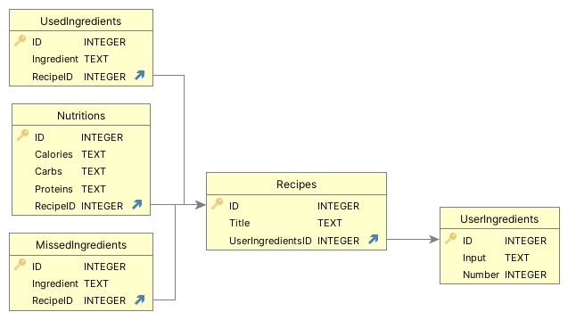

# Recipe-Finder

### Description:
Recipe-finder is application that allows user to provide ingredients and number of recipes. 
Program will return the appropriate amount of meals with the minimum amount of missing ingredients.
The logic is built using [Spooncular API](https://spoonacular.com/food-api/).
The program also has a local SQLlite database in which the data entered by the user is saved along with the response from the API. 
If the input data is repeated, the program will not make an unnecessary API request.

### How to run project?
Clone the repository and run one of these commands:
```bash
go run main.go --ingredients=tomatoes,eggs,pasta --numberOfRecipes=5
```

### Don't forget to:
- add your API_KEY in ...
- have GO installed on your computer
- install SQLite viewer extension (available for VisualStudio) to see data in database file.

### Database design:

